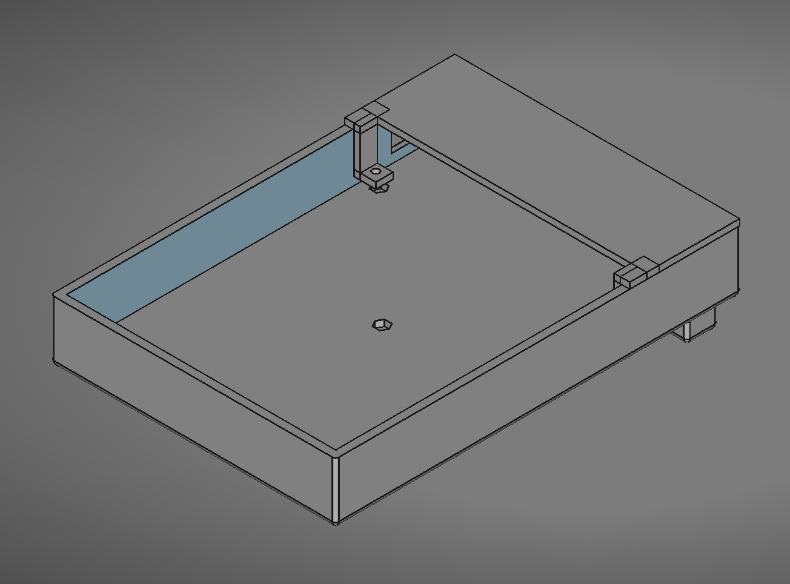
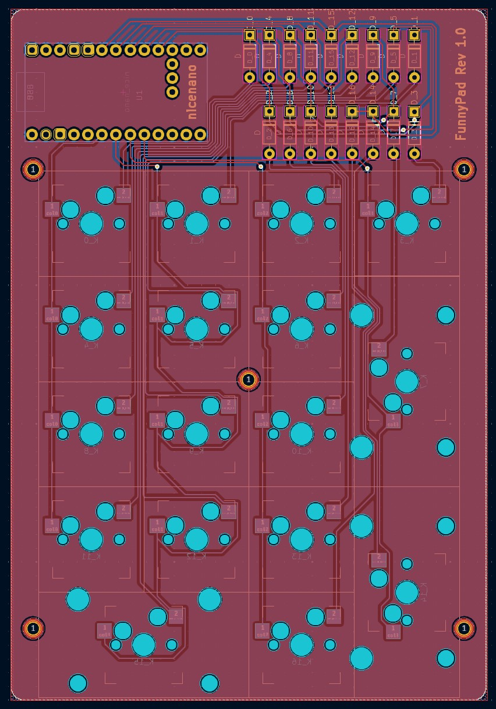
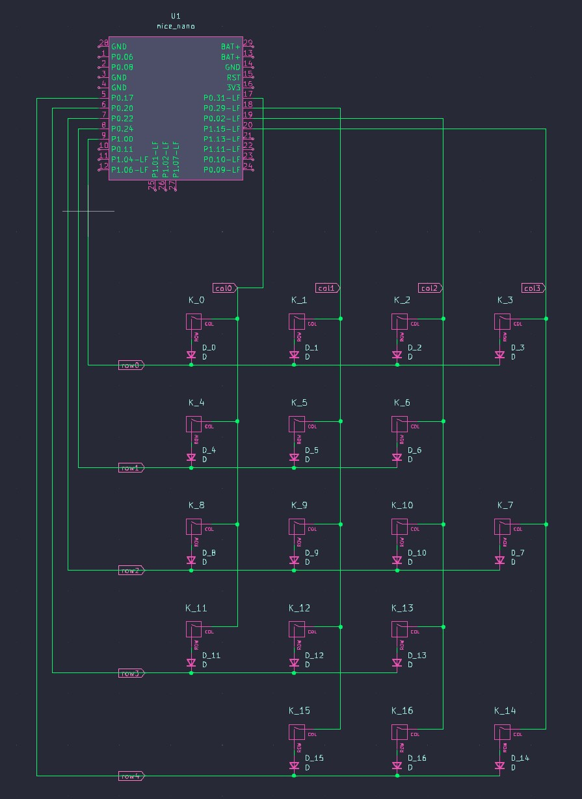

# FunnyPad
Yet another basic 17 key keypad with kailh hotswap sockets designed for fun.  
Made with the [nice!nano v2](https://nicekeyboards.com/docs/nice-nano/), but compatible with any Pro Micro boards.  
My first PCB, please leave feedback. 

CAD model  
  
PCB in kicad (2 layers)  
  
Schematic  
  

## Features
- Wired/Bluetooth with rechargeable battery (as many mAh as you want!!!)
- Kailh hotswap sockets!!!
- I spent my free time on this
- Screw on stabilizers
- ZMK compatibility

## Parts required
- nice!nano v2 x1
- kailh hotswap sockets x17
- 1N4148 through hole diodes x17
- M2*5mm screws x3
- M2*8mm screws x2
- M2*5mm Hexagonal threaded spacers x5 
- 301230 3.7v 110mAh battery x1
- 2U screw on stabs x3
- Socket for nice!nano x1
- Switches of your choice x17

## Assembly

## References
- Made with KiCad8 and FreeCad
- Software done and compiled with github actions using [ZMK](https://zmk.dev/)
- Schematic and PCB partly generated from https://kb.xyz.is/ used in conjunction with https://www.keyboard-layout-editor.com/#/
- Nice!nano footprint from https://github.com/ebastler/marbastlib
